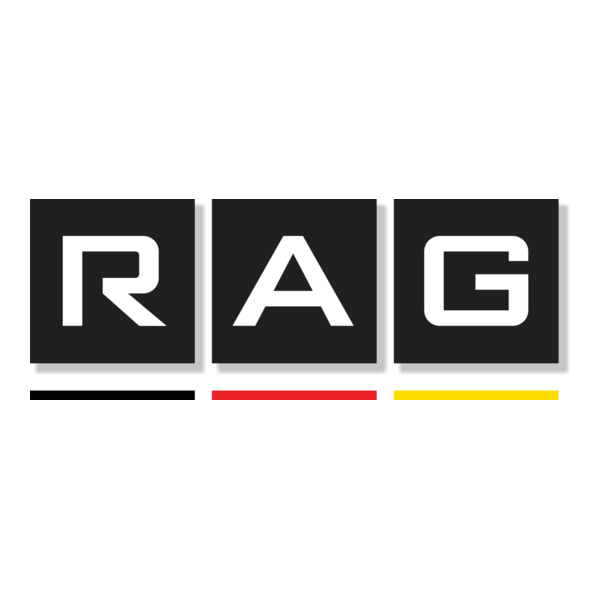

<p align="center">
  
</p>

<h1 align="center"> Mini RAG Chatbot – Local AI Assistant</h1>

<p align="center">
  <em>An intelligent local assistant that answers questions from PDFs using Retrieval-Augmented Generation (RAG)</em>
</p>

<p align="center">
  
  
  
  
</p>

---

## 📚 Table of Contents
| Section | Description |
|----------|--------------|
| [🎯 Project Goal](#-project-goal) | Overview and objectives |
| [🧩 Tech Stack](#-tech-stack) | Tools and frameworks used |
| [🏗️ Architecture Overview](#️-architecture-overview) | System design and pipeline |
| [🧠 Models Used](#-models-used) | LLM and embeddings details |
| [📄 Data Source](#-data-source) | Input document and processing |
| [⚙️ Installation & Usage](#️-installation--usage) | Setup and execution guide |
| [🐳 Docker](#-docker-optionnel) | Containerization instructions |
| [🚀 Features](#-features) | Key capabilities |
| [📦 Project Structure](#-project-structure) | Folder and file organization |
| [💡 Next Steps](#-next-steps) | Future improvements |
| [👤 Author](#-author) | Credits and contact |
| [📝 License](#-license) | Licensing details |


---

## 🎯 Project Goal

Create a **local intelligent assistant** capable of answering natural language questions based on a PDF document.
The project implements a **Retrieval-Augmented Generation (RAG)** architecture to combine **semantic search** and **text generation**, ensuring **accurate**, **relevant**, and **context-aware responses**. 

__

Créer un **assistant intelligent local** capable de répondre à des questions en langage naturel à partir d’un document PDF.  
Le projet met en œuvre une architecture **Retrieval-Augmented Generation (RAG)** pour combiner **recherche sémantique** et **génération de texte**, garantissant des **réponses précises, pertinentes et contextuelles**.

---

## 🧩 Tech Stack

| Category | Tools / Frameworks |
|-----------|--------------------|
| **Langage** | Python |
| **Framework RAG** | LangChain |
| **LLM Local** | Ollama (Mistral) |
| **Vector Store** | ChromaDB |
| **Interface Web** | Gradio |
| **Conteneurisation** | Docker |
| **Embeddings** | nomic-embed-text |
| **Alternative Vector Store** | FAISS |

---

## 🏗️ Architecture Overview

```text
Pipeline RAG complet :

 ┌───────────────────────────┐
 │        User Uploads       │
 │         PDF File          │
 └────────────┬──────────────┘
              │
              ▼
 ┌───────────────────────────┐
 │        PDF Loader         │
 │ - Reads & splits content  │
 │ - Cleans and prepares text│
 └────────────┬──────────────┘
              │
              ▼
 ┌───────────────────────────┐
 │     Embeddings Engine     │
 │ - nomic-embed-text model  │
 │ - Converts text → vectors │
 └────────────┬──────────────┘
              │
              ▼
 ┌───────────────────────────┐
 │       Vector Store        │
 │         ChromaDB          │
 │ - Stores embeddings       │
 │ - Enables semantic search │
 └────────────┬──────────────┘
              │
              ▼
 ┌───────────────────────────┐
 │     RAG Pipeline (LLM)    │
 │ - Mistral via Ollama      │
 │ - Retrieves context + gen │
 │ - Produces final answer   │
 └────────────┬──────────────┘
              │
              ▼
 ┌───────────────────────────┐
 │         Gradio UI         │
 │ - Chat interface          │
 │ - Displays responses      │
 └───────────────────────────┘

User Query → PDF Splitter → Embeddings → Vector Store → RAG Chain → Answer

```
## 🚀 Features

- **Local RAG Intelligence:** Combines semantic retrieval and generative AI for accurate, contextual answers from PDFs.  
- **PDF Understanding:** Automatically extracts, splits, and processes PDF documents for question answering.  
- **End-to-End RAG Pipeline:** Integrates LangChain + ChromaDB + Mistral (via Ollama) for retrieval-augmented generation.  
- **100% Local Execution:** All data and inference happen locally — ensuring complete privacy and control.  
- **Interactive Gradio UI:** Simple and responsive web interface for seamless chatbot interactions.  
- **Fast Vector Search:** Uses optimized embeddings with `nomic-embed-text` and ChromaDB for efficient retrieval.  
- **Docker-Ready Deployment:** Fully containerized for quick setup and reproducible environments.  
- **Modular Codebase:** Clean architecture enabling easy integration of new models or vector databases.  
- **Scalable Extensions:** Future-proof design — ready for multi-document support, advanced analytics, and new LLMs.  


## 🧠 Models Used

° LLM : Mistral déployé localement via Ollama

Embeddings : nomic-embed-text — modèle léger et performant pour la vectorisation rapide

° Data Source :Fichiers PDF uploadés par l’utilisateur

Le contenu est : découpé et nettoyé, vectorisé et stocké localement, interrogé en toute confidentialité et rapidité.

## ⚙️ Installation & Usage
1️⃣ Cloner le projet
git clone https://github.com/<your_username>/mini_rag.git
cd mini_rag

2️⃣ Créer et activer l’environnement virtuel
python -m venv .venv
# Sur Windows :
.venv\Scripts\Activate.ps1
# Sur macOS / Linux :
source .venv/bin/activate

3️⃣ Installer les dépendances
pip install -r requirements.txt

4️⃣ Lancer l’application
python app.py


L’application s’exécute ensuite en local sur :
👉 http://127.0.0.1:7860

Vous pouvez y uploader un PDF et interagir avec le chatbot directement depuis l’interface web.
